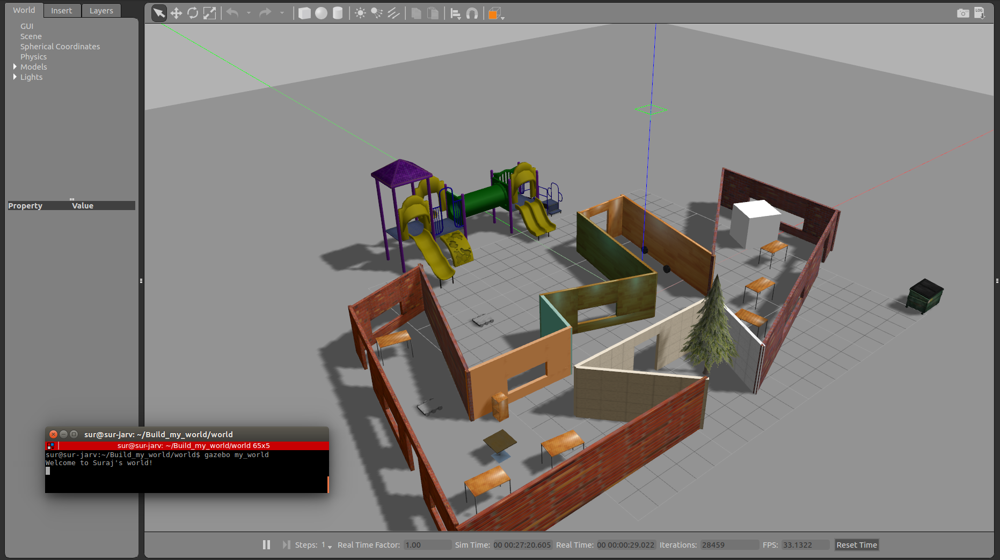

[](https://www.udacity.com/robotics)

# Udacity Nanodegree: Robotics Software Engineer

## Project 01: Build My World

### Directory Structure
```
. Build_my_world
├── CMakeLists.txt
├── docs
│   ├── my_world.png
│   ├── notes
│   └── with_output.png
├── LICENSE
├── model
│   ├── metal_hawk
│   │   ├── model.config
│   │   └── model.sdf
│   └── my_building
│       ├── model.config
│       └── model.sdf
├── README.md
├── script
│   └── welcome_message.cpp
└── world
    └── my_world

```

### Output
